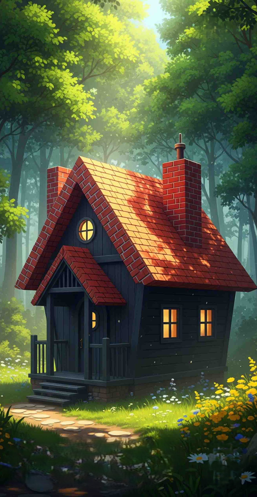

# liquid_glass_switch

A reusable Flutter switch widget with a liquid-glass look, spring motion, and shader-based refraction.

## Features

- Controlled API (`value` + `onChanged`)
- Drag and tap interaction
- Configurable faces (`label`, `icon`, `tint`)
- Configurable motion (`spring`, `duration`, `flickThreshold`)
- Built-in accessibility semantics
- Includes an `example/` app

## Preview



## Installation

```yaml
dependencies:
  liquid_glass_switch: ^0.1.0
```

## Usage

```dart
import 'package:flutter/material.dart';
import 'package:liquid_glass_switch/liquid_glass_switch.dart';

class Demo extends StatefulWidget {
  const Demo({super.key});

  @override
  State<Demo> createState() => _DemoState();
}

class _DemoState extends State<Demo> {
  bool isSleep = true;

  @override
  Widget build(BuildContext context) {
    return Center(
      child: LiquidGlassSwitch(
        value: isSleep,
        onChanged: (value) => setState(() => isSleep = value),
        leftFace: const LiquidGlassSwitchFace(
          label: 'Work',
          icon: Icons.person_rounded,
          tint: Color(0xFFFFD45F),
        ),
        rightFace: const LiquidGlassSwitchFace(
          label: 'Sleep',
          icon: Icons.nightlight_round,
          tint: Color(0xFF8B8EFF),
        ),
      ),
    );
  }
}
```

## API

- `LiquidGlassSwitch`
  - `value` (required)
  - `onChanged` (required)
  - `leftFace`, `rightFace`
  - `width`, `enabled`, `motion`
- `LiquidGlassSwitchFace`
  - `label`, `icon`, `tint`
- `LiquidGlassSwitchMotion`
  - `spring`, `duration`, `flickThreshold`

## Example app

Run the demo:

```bash
cd example
flutter run
```

## License

MIT
